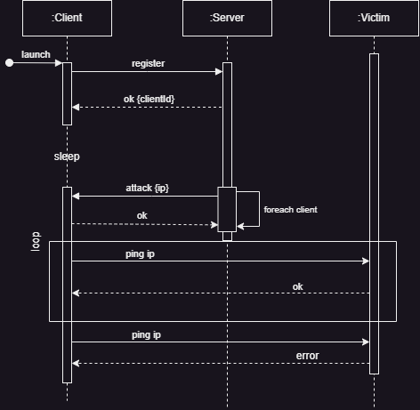

# Denial of Service Attack
Este proyecto consiste en un simulador de ataque DoS basado en un programa Cliente - Servidor en el que los clientes realizan un ataque dirigido por el servidor.

## Modo de funcionamiento
El flujo del ataque es:
1. Los clientes se registran en la base de datos de nuestra botnet.
2. El servidor de la botnet se prepara para un ataque
    1. Se le especifica el servidor a atacar
    2. Se informa a cada cliente registrado
3. Cada cliente realiza peticiones a la victima

Este es el esquema de funcionamiento del sistema.

La zona del loop es la parte que se encarga de realizar el ataque al servidor de la victima; en este caso esta detallado como `ping` pero puede estar compuesta de otras peticiones al servidor.

### Servidor
El servidor consiste de una API la cual permite registrar clientes y en un momento dado planear un ataque.

Por tanto la API tendrá las rutas:

    [GET]  /api/Register  ---> Registra un nuevo cliente
    [POST] /api/Attack    ---> Prepara un ataque
La documentación se puede encontrar en el Swagger de la API.

### Cliente
El cliente consiste de una aplicación de consola que se conecta al servidor registrandose en este.
Una vez registrado se queda a la espera de alguna solicitud de ataque.

Cuando un ataque empieza el cliente se dedica a realizar peticiones al servidor de la víctima hasta que esta le devuelve un codigo de error.
